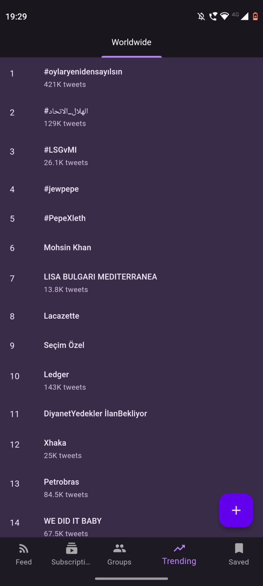

<h1 align="center"> Quacker </h1>  

  

  A fork of fritter that does so much more...

  

## Features (From Fritter)
* Device-local subscriptions and groups
* Device-local saving of tweets, allowing offline reading
* Viewing profiles
* Viewing tweets, and tweet replies, threads and conversations
* Viewing and downloading pictures, videos and GIFs in tweets
* Searching for tweets and users
* Viewing trending topics
* Supports opening twitter.com links directly

## Features (From Quacker)
* Feed viewing within the app
* Tweet searching
* Hashtag viewing
* Proper Material3 support

## Screenshots
|  |  |  |  |  |

## Acknowledgments
Icon made with [OpenMoji](https://openmoji.org/)

## Translation

Help translate this project on [Hosted Weblate](https://hosted.weblate.org/projects/fritter/).
