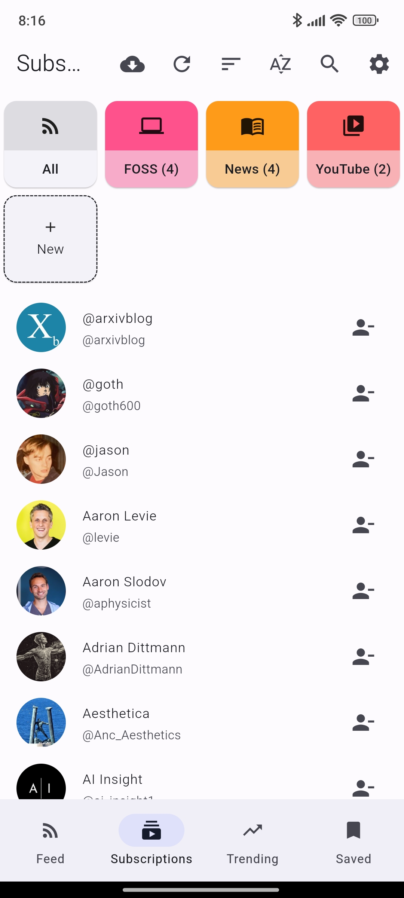
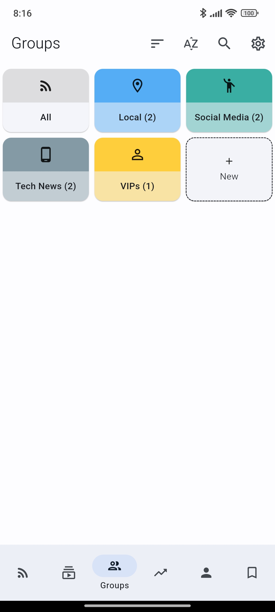
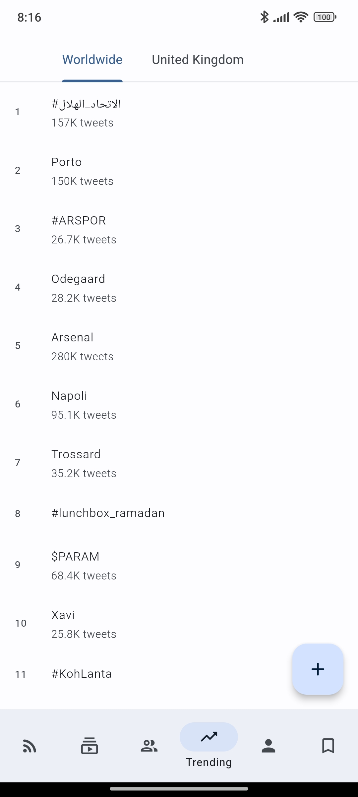
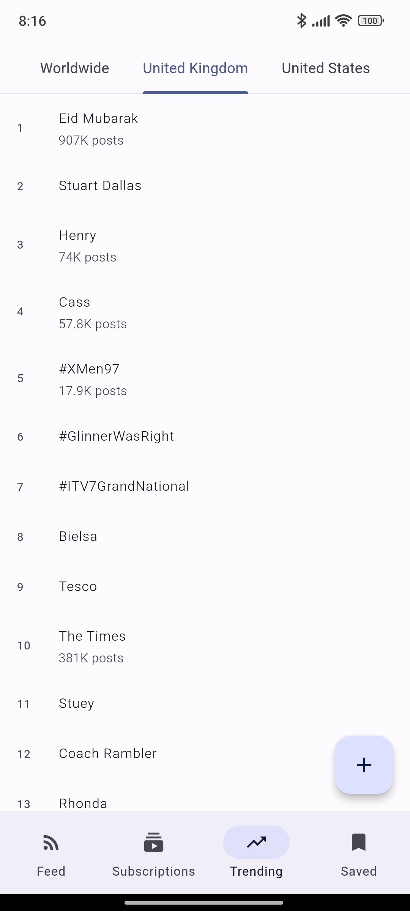

<h1 align="center">Quacker</h1>

  

A private and clean way to browse Twitter/X

  
  

  
  
  
  
  

## Features:
- **Feed:** View your `Following` and `For You` feeds
- **Material You:** Looks and feels modern
- **Bookmarks:** Save posts locally and offline
- **Trends:** See what's trending in the world
- **Light and Dark themes:** Protect your eyes
- **Subscriptions:** Follow and group accounts
- **Polls:** View results without needing to vote
- **Search:** Find users and posts
- **And more!**

## Screenshots

| Viewing subscriptions | Viewing a profile | Tweet cards | Viewing trends |
|:----------------------:|:-----------------:|:-----------:|:--------------:|
|  |  |  |  |

## Community
### Stargazers

### Forkers

## Contribute
If you'd like to help make Quacker even better, here are a few ways you can contribute:

- **Report a bug:** If you've found a bug in Quacker, open a [new issue](https://github.com/thehcj/quacker/issues/new/choose), but please make sure to check that someone else hasn't reported it first.
- **Request a feature:** Feel like something is missing from Quacker? [Open an issue](https://github.com/thehcj/quacker/issues/new/choose) about it, detailing exactly what you're looking for.
- **Fix a bug:** If you're looking to contribute to the codebase, check for issues labeled "good first issue". Otherwise, feel free to tackle any other issue, fork the repository, push to a branch, and create a pull request.
  
## Translations

You can help by translating the app into your preferred language(s)!
1. Use [Weblate](https://hosted.weblate.org/projects/quacker/quacker/) for translations **(RECOMMENDED)**
2. Use the [⚐ Translations](https://github.com/TheHCJ/Quacker/issues/new?assignees=&labels=needs+triage&projects=&template=--translations.md&title=%5BTRANSLATION%5D) issue template
