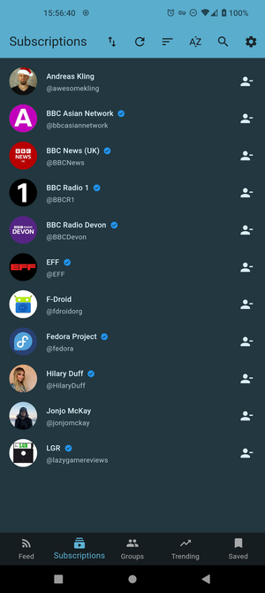
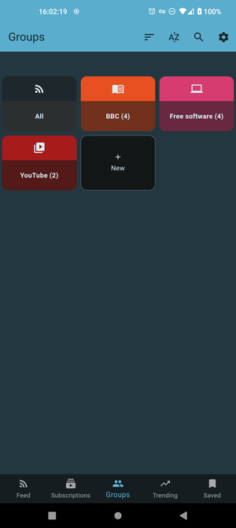
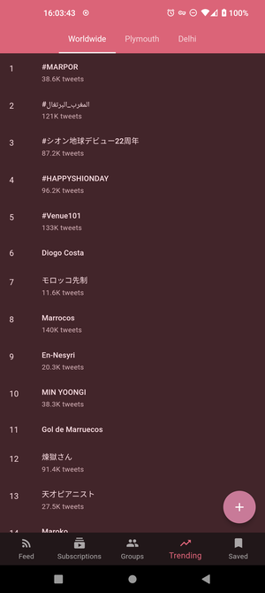

<h1 align="center"> Quacker </h1>  

  

  A fork of <a href="https://github.com/jonjomckay/">fritter</a> that does so much more...

## Features

* Privacy: No tracking, with all data local
* Bookmarks: Save tweets locally and offline
* Trends: See what's trending in the world
* Light and Dark themes: Protect your eyes
* Subscriptions: Follow and group accounts
* Polls: View results without needing to vote
* Search: Find users and tweets
* And more!

## Screenshots

| |  |  |  |  |

## Contribute
If you'd like to help make Quacker even better, here are a just a few of the ways you can help!

### Report a bug
If you've found a bug in Quacker, open a [new issue](https://github.com/TheHCJ/Quacker/issues/new/choose), but please make sure to check that someone else hasn't reported it first.

### Request a feature
If you feel like something is missing from Quacker, feel free to [open an issue](https://github.com/TheHCJ/Quacker/issues/new/choose) about it, detailing exactly what you're looking for. We'll look it over, discuss it with the community, and see if it'll work!

### Fix a bug
If you're looking for something to dip your toes into the codebase, check if there are any issues labelled good first issue. Otherwise, if you see another issue you'd like to tackle, go for it - just fork the repository, push to a branch, and create a PR detailing your changes. We'll review it and merge it in, once it meets all our checks and balances!

### Translate
Quacker shares the [fritter]() [Weblate](https://hosted.weblate.org/engage/fritter/) for translations. You can help by translating the app into your preferred language(s)!

## Acknowledgments
* Icon made using OpenMoji
* Some icons made by [Freepik](https://www.freepik.com) from [www.flaticon.com](https://www.flaticon.com).