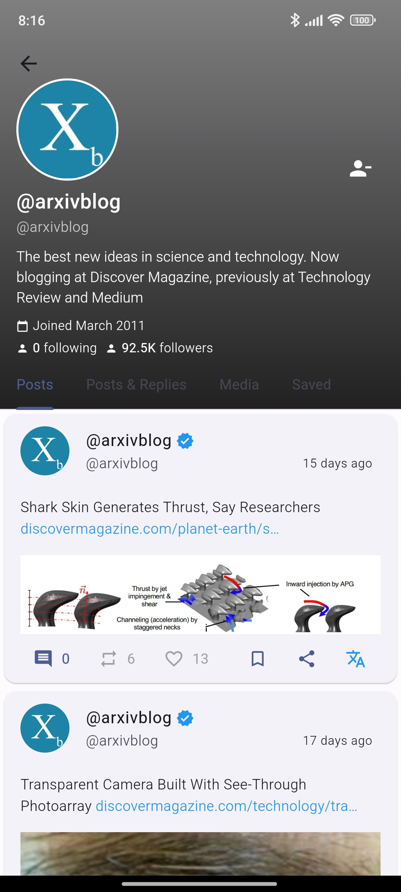
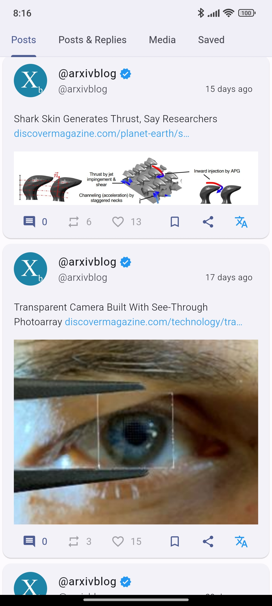

<h1 align="center"> Quacker </h1> <br>
<p align="center">
  <a href="https://github.com/thehcj/quacker">
    
  </a>
</p>
<p align="center">
  A private and clean way to browse X
</p>

<p align="center">
  <a href="https://apt.izzysoft.de/fdroid/index/apk/com.thehcj.quacker">
    </a>
</p>
<p align="center">
<a href="https://github.com/TheHCJ/Quacker/issues"></a>
<a href="https://github.com/TheHCJ/Quacker"></a>
<br>
<a href="https://flutter.dev"></a>
<a href="https://github.com/TheHCJ/Quacker?tab=readme-ov-file#translations-"></a>
<a href="https://android.com"></a>
</p>
 
## Features:
* Feed: View your `Following` or if you prefer your `For You` feed
* Material You: Made to suit you
* Transfer: Easily export your data
* Private: Most of your data stays on device
* Updated: Constantly being worked on

## Screenshots

| |  | 

## Contribute
If you'd like to help make Quacker even better, here are a just a few of the ways you can help!

### Report a bug
If you've found a bug in Quacker, open a [new issue](https://github.com/thehcj/quacker/issues/new/choose), but please make sure to check that someone else hasn't reported it first.

### Request a feature
If you feel like something is missing from Quacker, feel free to [open an issue](https://github.com/thehcj/quacker/issues/new/choose) about it, detailing exactly what you're looking for. We'll look it over, discuss it with the community, and see if it'll work!

### Fix a bug
If you're looking for something to dip your toes into the codebase, check if there are any issues labelled good first issue. Otherwise, if you see another issue you'd like to tackle, go for it - just fork the repository, push to a branch, and create a PR detailing your changes. We'll review it and merge it in, once it meets all our checks and balances!

## Translations <a href="https://hosted.weblate.org/engage/quacker/"></a>

You can help by translating the app into your preferred language(s)!
1. You can use [Weblate](https://hosted.weblate.org/projects/quacker/quacker/) for translations (RECOMMENDED)
2. You can use the [⚐ Translations](https://github.com/TheHCJ/Quacker/issues/new?assignees=&labels=needs+triage&projects=&template=--translations.md&title=%5BTRANSLATION%5D) issue template

## LICENSE
TL;DR: We don't care what you do with the code within Quacker aslong as you include this license within your project

```
Copyright 2021 Jonjo McKay
Copyright 2024 Harley Jones

Permission is hereby granted, free of charge, to any person obtaining a copy of this software and associated documentation files (the "Software"), to deal in the Software without restriction, including without limitation the rights to use, copy, modify, merge, publish, distribute, sublicense, and/or sell copies of the Software, and to permit persons to whom the Software is furnished to do so, subject to the following conditions:

The above copyright notice and this permission notice shall be included in all copies or substantial portions of the Software.

THE SOFTWARE IS PROVIDED "AS IS", WITHOUT WARRANTY OF ANY KIND, EXPRESS OR IMPLIED, INCLUDING BUT NOT LIMITED TO THE WARRANTIES OF MERCHANTABILITY, FITNESS FOR A PARTICULAR PURPOSE AND NONINFRINGEMENT. IN NO EVENT SHALL THE AUTHORS OR COPYRIGHT HOLDERS BE LIABLE FOR ANY CLAIM, DAMAGES OR OTHER LIABILITY, WHETHER IN AN ACTION OF CONTRACT, TORT OR OTHERWISE, ARISING FROM, OUT OF OR IN CONNECTION WITH THE SOFTWARE OR THE USE OR OTHER DEALINGS IN THE SOFTWARE.
```
<br>
<br>
<p align=center>Made with 💙 by Harley Jones</p>
